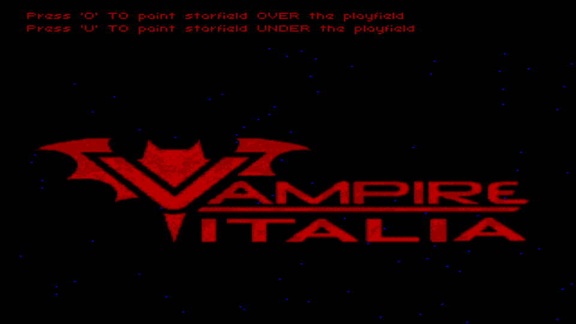

### Starfield Amiga demo
This is just a little demostration on how to recycle hardware sprites on Amiga Computers. 

This project takes advantage of the glorious ACE Engine by Kain at https://github.com/AmigaPorts/ACE



##### Build instructions

To get the executable just clone the project and compile it with m68k-amigaos-gcc from Bebbo. 

If you dont have time to build your toolchain you can use my docker image:

```
docker run -it --rm -v #where you cloned the repo#:/data -w /data ozzyboshi/acedocker:20200311 /bin/bash
autoreconf -i
configure --host m68k
make
```

at this point you should have the executable built into your src directory.

Alternatively you can download the executable from the Github release page of this project.

##### How to run
Nothing special, just copy the executable somewhere in your Amiga machine and launch it from the CLI or double clicking on its icon from the Workbench. 
The project has been tested on real A600. 

##### What is this about
It's just a little demonstration on how to use Hardware sprites, each star in this demo is a sprite and 111 stars are drawn on the same frame.  
The height of each sprite is 1 pixel, the width 16px.  
As you may know old Amigas computers only have 8 sprites, we get 111 using a well known trick called "sprite recycling", all the sprites are concatenated one after another like a big sprite.  
The only requirement is that that must be a difference of each sprite height of at least 1 pixel, this is why I ended up using 111 sprites.  
The horizontal positions of the stars are generated randomly at boot time so each time you run the demo you get a different star pattern even it's hard to notice on a first glance.  
The stars are divided in 3 groups, the first one travels at slow speed, the second one at medium speed and the third one at high speed. You can adjust the speed just controlling how much the moveStars function is called each frame.  
The stars run under a playfield containing a Vampire Italia logo (if you like Vampire accellerators please visit our forum at https://vampireitalia.forumfree.it/ ), pressing the 'O' keyboard button the playfield/sprite priority changes giving more priority to the stars.
